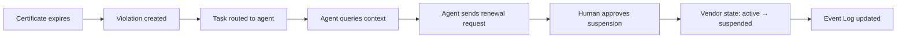

This example shows how Heirloom turns a business workflow into a governed agent runtime. The scenario is a **vendor certification process** in a supply-chain team.

## 1. Model the business context

Define the Resource Types:

```json
{
  "name": "Vendor",
  "abilities": ["key", "query", "mutate", "freeze"],
  "fields": {
    "name": "string",
    "status": "string"
  },
  "stateMachine": {
    "states": ["draft", "active", "suspended", "archived"],
    "transitions": [
      {"from": "draft", "to": "active", "on": "certify"},
      {"from": "active", "to": "suspended", "on": "flag"},
      {"from": "active", "to": "archived", "on": "archive"}
    ]
  }
}
```

```json
{
  "name": "Certificate",
  "abilities": ["key", "query", "mutate", "drop"],
  "fields": {
    "type": "string",
    "expiration_date": "date"
  }
}
```

Define the relationship:

```json
{
  "name": "vendor_certificate",
  "from": "Vendor",
  "to": "Certificate",
  "type": "Ownership"
}
```

## 2. Declare the rule

A constraint detects active vendors with expired certificates:

```json
{
  "name": "active_vendor_requires_valid_certificate",
  "query": {
    "from": "Vendor",
    "alias": "v",
    "filter": {"v.status": "active"},
    "traverse": [
      {"path": "v --[vendor_certificate]--> Certificate as c"}
    ],
    "filter": {"c.expiration_date": {"$lt": "#now"}}
  }
}
```

When this query returns results, violations are created.

## 3. Define the agent role

Create a minimal-capability role for the agent:

```python
from heirloom_sdk import HeirloomClient

role = HeirloomClient.role_template("supply_chain_analyst")
```

The role can query vendors and certificates and send notifications. It cannot mutate vendors or delete certificates.

## 4. Deploy and run

The runtime evaluates the constraint continuously. When a certificate expires:

1. A **Violation** resource is created.
2. A **Task** is routed to the agent.
3. The agent queries context: vendor history, certificate status, related orders.
4. The agent invokes allowed Actions:
   - `notification.send` to request renewal.
   - `knowledge.search` to find the renewal policy.
5. A human approves the vendor suspension if needed.
6. Every step is recorded in the Event Log.



## 5. Observe and correct

Operators can:

- View the agent's activity timeline.
- Replay the decision chain.
- See denied attempts and anomalies.
- Update the ontology if the rule was too strict or too lenient.

Corrections become new facts in the Event Log, not silent mutations. The next agent run inherits the improved context while preserving the history of what happened.
