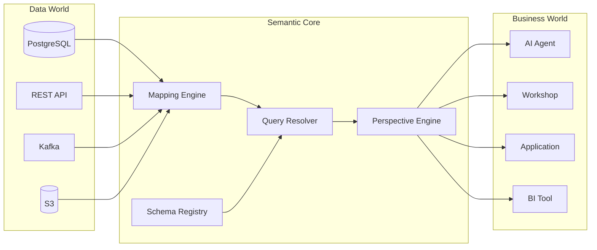

Heirloom is organized around a **semantic core**: a central hub that translates between the data world and the business world. AI agents, human users, and applications all use the same interface. There is no agent-only backdoor.



## System layers

```
┌─────────────────────────────────────────┐
│  Consumer Layer                         │  AI Agent SDK · Workshop · REST API · GraphQL · BI Connector
├─────────────────────────────────────────┤
│  Operations Layer                       │  Action & Function execution · Capability validation · State machine · Approvals
├─────────────────────────────────────────┤
│  Semantic Core                          │  Schema Registry · Mapping Engine · Query Resolver · Perspective Engine
├─────────────────────────────────────────┤
│  Storage Layer                          │  Resource Store · Graph Store · Event Log · Indexes
├─────────────────────────────────────────┤
│  Integration Layer                      │  Connectors · Transforms · CDC · Incremental sync
└─────────────────────────────────────────┘
```

## Semantic Core subsystems

| Subsystem | Responsibility | Value for agents |
|-----------|----------------|------------------|
| **Schema Registry** | Stores Resource Types, abilities, state machines, roles | Agent knows what exists and what is allowed |
| **Mapping Engine** | Maps business fields to physical data sources | Agent queries `Customer.tier`, not table columns |
| **Query Resolver** | Translates JSON DSL queries into execution plans | LLM-friendly, injection-safe query language |
| **Perspective Engine** | Crops fields and relationships by role | Agent only sees data it is allowed to see |

## Integration layer

Connectors bring multi-source data into Heirloom:

- **DB Connector** — relational databases with full-load and CDC incremental sync.
- **API Connector** — REST / GraphQL endpoints, polling and webhook modes.
- **Stream Connector** — Kafka, Pulsar, and similar message queues.
- **File Connector** — S3, HDFS, Parquet, CSV, JSON.

Data passes through a Transform pipeline before being exposed as Resources.

## Storage layer

Storage is separated by access pattern:

| Store | Contents | Typical technology |
|-------|----------|--------------------|
| **Resource Store** | Resource bodies | Document database |
| **Graph Store** | Relationships | Property graph database |
| **Event Log** | Immutable action events | Log store / PostgreSQL |
| **Indexes** | Attribute, full-text, vector indexes | Elasticsearch / pgvector |

## Operations layer

The operations layer runs Actions and Functions.

Actions pass through the [nine-step pipeline](/concepts/actions). Functions follow a shorter read-only path because they cannot change state.

## Consumer layer

- **AI Agent SDK** — structured JSON tools for agents.
- **Workshop** — low-code UI for human operators.
- **REST API / GraphQL** — standard application interfaces.
- **BI Connector** — analytical tools.

All consumers share the same validation and audit chain.
