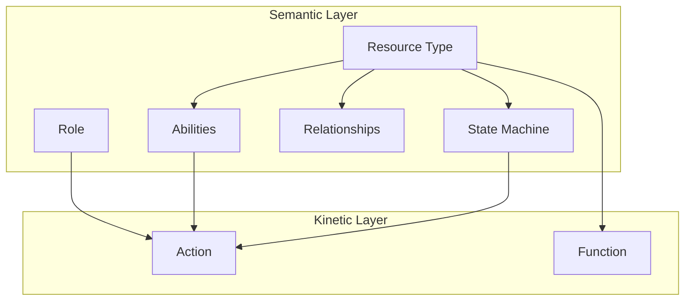

Heirloom organizes the world into two orthogonal layers:

- **Semantic primitives** describe what can exist: Resource Types, fields, relationships, abilities, state machines, and roles.
- **Kinetic primitives** describe what can happen: Actions that change state and Functions that compute read-only values.

The core rule: **semantic primitives are hard boundaries for kinetic primitives**. Any Action or Function can only do what the semantic layer has already declared allowed.



## Semantic primitives

| Primitive | Answers the question |
|-----------|----------------------|
| **Resource Type** | What kinds of business entities exist? |
| **Property / Field** | What attributes does each entity have? |
| **Relationship** | How do entities relate? |
| **Abilities** | What is this type allowed to do? |
| **State Machine** | What states are legal, and how can it move between them? |
| **Role** | Who is granted what capability, at what scope? |

## Kinetic primitives

| Primitive | Purpose | Side effects |
|-----------|---------|--------------|
| **Action** | Structured write operation | Changes Resource state |
| **Function** | Read-only computation | None |

## The security chain

A request flows from actor to resource through a single, shared chain:

```
Actor → Role → Capability → Action/Function → Resource
```

Humans, AI agents, and automation workflows all use the same chain. The only difference is the Role they hold.
