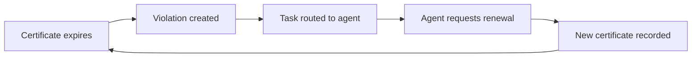

## The semantic layer for enterprise agents

Heirloom lets AI agents understand the business, act through governed workflows, persist state, explain what happened, and stay inside hard system boundaries.

Model your operations as a semantic ontology: resources, relationships, abilities, state machines, and actions. Agents query current and historical state, invoke deterministic business operations, and leave every attempt in an auditable event log.

## The access problem

Enterprise AI has two equally bad options today:

- **Sandbox mode** — agents see nothing. Safe, but useless.
- **Database mode** — agents get a connection string. Useful, but dangerous.

In the second mode, an LLM hallucination can become a `DROP TABLE`. A prompt that says "be careful" is a request, not a constraint. The missing piece is a semantic layer between raw data and the agent: a layer where operations are typed, capabilities are explicit, and unsafe requests are rejected by the system itself.

Heirloom is that layer.

## Nine primitives for governed agent operations

Agents get durable business context from these building blocks. Each primitive is defined in the ontology and enforced by the runtime.

### Resources

Things with stable identity and typed attributes. Customers, orders, contracts, assets: the nouns agents must not confuse.

### Resource Types

The semantic contract for a resource: fields, abilities, state machine, and relationships. Registered and versioned in the Schema Registry.

### Abilities

Type-level capability contracts. A Resource Type declares whether its instances can be queried, mutated, transferred, copied, frozen, or dropped. If `drop` is not declared, no role — not even admin — can create an action that deletes the resource.

### Relationships

Typed, precise connections between resources:

- **Ownership** — lifecycle dependency; cascade on delete.
- **Reference** — pointer without dependency; break on delete.
- **Association** — independent link.

### State Machines

Legal state transitions are declared upfront. An attempt to move a resource through an undefined edge is rejected at the type layer, not by a hand-written `if` statement.

### Actions

The only structured write path. Every action flows through a nine-step pipeline: Auth, Role, Capability, Gate, State, Validate, Execute, Event, Notify.

### Functions

Read-only computations over resources. Functions can be invoked by agents, actions, or applications, but they never change resource state.

### Roles

Static identities granted at ontology, resource-type, or resource-instance scope. Roles bridge actors to capabilities.

### Capabilities

Short-lived, revocable tickets derived from roles. A capability specifies which actions an actor can perform on which resources.

## From model to agent workflow

A typical vendor-certification workflow with memory, rules, and auditability:

1. **Define the business context** — model `Vendor`, `Certificate`, and the relationship between them.
2. **Declare the rule** — a constraint marks active vendors with expired certificates as violations.
3. **Let the agent work inside the loop** — the runtime evaluates the rule continuously. When a certificate expires, a violation surfaces, a task is routed, and the agent gathers context, requests renewal, and records what changed.

## The layer beneath reliable agents

Heirloom is not a model. It is the operational substrate underneath models.

| Pillar | What it does |
|--------|--------------|
| **Schema Registry** | Stores Resource Types, abilities, state machines, and roles. The agent's runtime dictionary. |
| **Mapping Engine** | Translates business fields to physical sources. Agents query `Customer.tier`, not `postgres.customers.tier_column`. |
| **Query Resolver** | Turns LLM-friendly JSON DSL queries into execution plans across multiple sources. |
| **Perspective Engine** | Crops returned fields and relationships based on the caller's role. |
| **Event Log** | Appends every action, success or denial, as an immutable event. |

## Agent work becomes observable state

Workflows run through memory, rules, actions, approvals, and feedback.

- **Memory** — every agent action writes facts: what it knew, what it changed, which source it used, who approved it, and when it happened.
- **Governance** — rules, tool boundaries, and approvals are explicit. Agents operate inside the business process.
- **Correction** — failures become inspectable state. Corrections become new facts. The next run has better context without erasing history.

## Model, query, act, observe, correct

1. **Model** the operational graph — entities, relationships, and rules.
2. **Query** the graph with structured JSON DSL.
3. **Act** through governed actions with typed boundaries.
4. **Observe** every attempt in the Event Log.
5. **Correct** the model or the data, and let the next run inherit the context.

## Start with one agent workflow

Encode the business context, rules, tools, approvals, and feedback loop your agent needs. Heirloom makes that workflow safe, observable, and reusable.

<CardGroup cols={2}>
  <Card title="Why Heirloom" icon="shield" href="/why-heirloom">
    See how Heirloom compares to sandboxing, database access, and function calling.
  </Card>
  <Card title="Quickstart" icon="rocket" href="/quickstart">
    Install the SDK and run your first semantic query in minutes.
  </Card>
</CardGroup>
