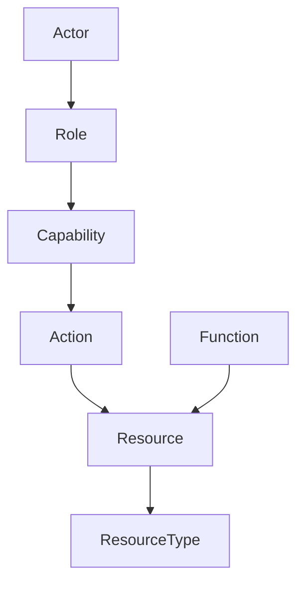

## The agent access dilemma

Giving an enterprise AI agent access to business data means choosing between two extremes:

- **No access** — the agent is locked in a sandbox and can only process what a human pastes into the chat. Safe, but unable to act.
- **Direct database access** — the agent receives a connection string and can issue arbitrary SQL. Flexible, but every LLM hallucination is a potential incident.

Heirloom introduces a third option: a **type-safe semantic layer** where agents operate on business resources, not database rows, and where unsafe operations are rejected by the system itself.

## How Heirloom differs

| Approach | How it works | The gap Heirloom fills |
|----------|--------------|------------------------|
| **Sandbox / no access** | Agent only sees pasted data | Cannot act on live systems |
| **Database connection** | Agent issues raw SQL | No type safety; hallucinations become destructive writes |
| **Data catalog** | Tells the agent where data lives | Does not provide safe operations on the data itself |
| **Graph database** | Rich relationship queries | Permissions and lifecycles are left to the application layer |
| **Function calling / tool use** | Agent calls pre-built tools | Safety depends on every tool developer remembering checks |
| **Palantir Ontology** | Action Types constrain writes | Permissions live in external RBAC, not inside the type definition |
| **Heirloom** | Resources + Abilities + Actions | Type-level permissions, unified audit chain, agent and human parity |

## Heirloom's design principle

Heirloom is built on one idea:

> **Do not rely on the actor's self-restraint. Rely on system boundaries that cannot be bypassed.**

- Agents do not access the database directly.
- Agents are not told "do not delete" in a prompt.
- Agents and humans flow through the exact same validation chain.
- Harmful operations are inexpressible in the type system.

If a Resource Type does not declare the `drop` ability, then no role — including admin — can create an action that deletes it. The boundary is enforced by the ontology, not by a configuration screen.

## Agent and human parity

In Heirloom, an AI agent is not a special kind of user with a separate security model. It is an **actor** that holds **roles**, receives **capabilities**, and invokes **actions** exactly like a human user.

You can define a `SupplyChainAnalyst` role for an agent that grants only `query` and `notification.send`. The agent cannot mutate, transfer, or drop resources — not because it was trained to be polite, but because its capability set does not include those abilities.

## What you get

- **Type-level safety** — abilities are declared in the Resource Type, not granted at runtime.
- **Complete auditability** — every action, success or denial, is appended to the immutable Event Log.
- **Governance by default** — schema changes flow through proposals, branches, and reviews.
- **Reusable operational models** — encode a workflow once, deploy it across teams and agents.

## When Heirloom fits

Heirloom is designed for:

- Enterprises deploying AI agents that need to act on business data.
- Regulated industries where every agent action must be auditable.
- Multi-system environments where agents need a unified semantic interface.

It is not designed for:

- Early prototypes with small, low-risk agent scope.
- Purely read-only analytics — a data warehouse is simpler.
- Small, high-trust internal tools where type-level enforcement is overkill.
