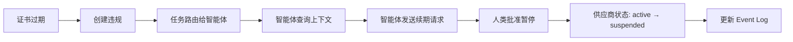

本示例展示 Heirloom 如何将业务工作流转换为受治理的智能体运行时。场景是供应链团队中的**供应商认证流程**。

## 1. 建模业务上下文

定义资源类型：

```json
{
  "name": "Vendor",
  "abilities": ["key", "query", "mutate", "freeze"],
  "fields": {
    "name": "string",
    "status": "string"
  },
  "stateMachine": {
    "states": ["draft", "active", "suspended", "archived"],
    "transitions": [
      {"from": "draft", "to": "active", "on": "certify"},
      {"from": "active", "to": "suspended", "on": "flag"},
      {"from": "active", "to": "archived", "on": "archive"}
    ]
  }
}
```

```json
{
  "name": "Certificate",
  "abilities": ["key", "query", "mutate", "drop"],
  "fields": {
    "type": "string",
    "expiration_date": "date"
  }
}
```

定义关系：

```json
{
  "name": "vendor_certificate",
  "from": "Vendor",
  "to": "Certificate",
  "type": "Ownership"
}
```

## 2. 声明规则

一个约束检测证书过期的活跃供应商：

```json
{
  "name": "active_vendor_requires_valid_certificate",
  "query": {
    "from": "Vendor",
    "alias": "v",
    "filter": {"v.status": "active"},
    "traverse": [
      {"path": "v --[vendor_certificate]--> Certificate as c"}
    ],
    "filter": {"c.expiration_date": {"$lt": "#now"}}
  }
}
```

当此查询返回结果时，违规被创建。

## 3. 定义智能体角色

为智能体创建最小能力角色：

```python
from heirloom_sdk import HeirloomClient

role = HeirloomClient.role_template("supply_chain_analyst")
```

该角色可以查询供应商与证书并发送通知。它不能修改供应商或删除证书。

## 4. 部署并运行

运行时持续评估约束。当证书过期时：

1. 创建 **Violation** 资源。
2. 向智能体路由 **Task**。
3. 智能体查询上下文：供应商历史、证书状态、相关订单。
4. 智能体调用允许的操作：
   - `notification.send` 请求续期。
   - `knowledge.search` 查找续期政策。
5. 如需，人类批准暂停供应商。
6. 每一步都记录在 Event Log 中。



## 5. 观察与修正

操作员可以：

- 查看智能体活动时间线。
- 回放决策链。
- 查看被拒绝的尝试与异常。
- 如果规则过严或过宽，更新本体。

修正成为 Event Log 中的新事实，而非静默变更。下一次智能体运行继承改进后的上下文，同时保留发生过的历史。
