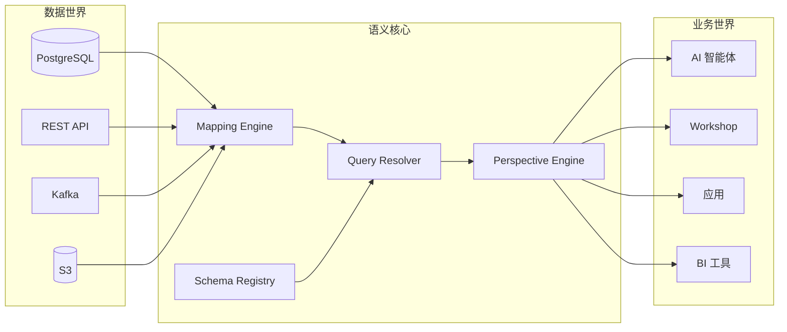

Heirloom 围绕一个**语义核心**组织：一个连接数据世界与业务世界的中央枢纽。AI 智能体、人类用户和应用都使用同一界面。不存在仅面向智能体的后门。



## 系统分层

```
┌─────────────────────────────────────────┐
│  消费层                                  │  AI Agent SDK · Workshop · REST API · GraphQL · BI Connector
├─────────────────────────────────────────┤
│  操作层                                  │  Action & Function 执行 · 能力验证 · 状态机 · 审批
├─────────────────────────────────────────┤
│  语义核心                                │  Schema Registry · Mapping Engine · Query Resolver · Perspective Engine
├─────────────────────────────────────────┤
│  存储层                                  │  Resource Store · Graph Store · Event Log · Indexes
├─────────────────────────────────────────┤
│  集成层                                  │  Connectors · Transforms · CDC · 增量同步
└─────────────────────────────────────────┘
```

## 语义核心子系统

| 子系统 | 职责 | 对智能体的价值 |
|-----------|----------------|------------------|
| **Schema Registry** | 存储资源类型、能力、状态机、角色 | 智能体知道存在什么、允许做什么 |
| **Mapping Engine** | 将业务字段映射到物理数据源 | 智能体查询 `Customer.tier`，而非表列 |
| **Query Resolver** | 将 JSON DSL 查询转换为执行计划 | 对 LLM 友好、无注入风险的查询语言 |
| **Perspective Engine** | 按角色裁剪返回的字段与关系 | 智能体只看到被允许的数据 |

## 集成层

连接器将多源数据引入 Heirloom：

- **DB Connector** —— 关系型数据库，支持全量加载与 CDC 增量同步。
- **API Connector** —— REST / GraphQL 端点，轮询与 Webhook 模式。
- **Stream Connector** —— Kafka、Pulsar 等消息队列。
- **File Connector** —— S3、HDFS、Parquet、CSV、JSON。

数据通过 Transform 管道后作为资源暴露。

## 存储层

按访问模式分离存储：

| 存储 | 内容 | 典型技术 |
|-------|----------|--------------------|
| **Resource Store** | 资源主体 | 文档数据库 |
| **Graph Store** | 关系 | 属性图数据库 |
| **Event Log** | 不可变操作事件 | 日志存储 / PostgreSQL |
| **Indexes** | 属性、全文、向量索引 | Elasticsearch / pgvector |

## 操作层

操作层运行操作与函数。

操作通过[九步流水线](/zh/concepts/actions)。函数遵循更短的只读路径，因为它们不能改变状态。

## 消费层

- **AI Agent SDK** —— 面向智能体的结构化 JSON 工具。
- **Workshop** —— 面向人类操作员的低代码界面。
- **REST API / GraphQL** —— 标准应用接口。
- **BI Connector** —— 分析工具。

所有消费者共享相同的验证与审计链。
