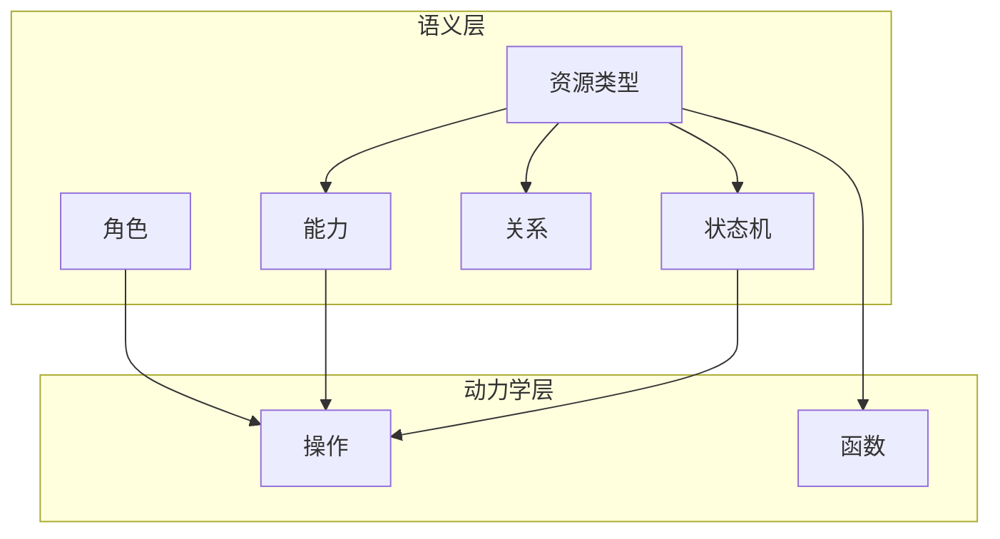

Heirloom 将世界划分为两个正交层：

- **语义原语**描述什么可以存在：资源类型、字段、关系、能力、状态机与角色。
- **动力学原语**描述什么可以发生：改变状态的操作和只读计算的函数。

核心规则：**语义原语是动力学原语的硬边界**。任何操作或函数只能做语义层已声明允许的事情。



## 语义原语

| 原语 | 回答的问题 |
|-----------|------|
| **资源类型** | 系统中存在哪些业务实体？ |
| **属性 / 字段** | 每个实体有哪些属性？ |
| **关系** | 实体之间如何关联？ |
| **能力** | 这个类型允许做什么？ |
| **状态机** | 实体有哪些合法状态，如何在状态间转移？ |
| **角色** | 谁在什么范围（全局 / 类型 / 实例）被授予了什么能力？ |

## 动力学原语

| 原语 | 用途 | 副作用 |
|-----------|---------|--------------|
| **操作** | 结构化写入操作 | 改变资源状态 |
| **函数** | 只读计算 | 无 |

## 安全链

请求从行为体到资源流经单一、共享的链：

```
行为体 → 角色 → 能力票据 → 操作/函数 → 资源
```

人类、AI 智能体和自动化都使用同一条链。区别只在于它们持有的角色。
