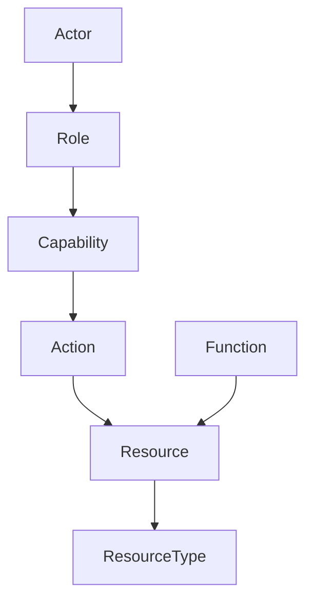

## 智能体访问困境

让企业 AI 智能体访问业务数据意味着在两个极端之间选择：

- **无访问** —— 智能体被锁在沙箱中，只能处理人类粘贴进聊天的内容。安全，但无法行动。
- **直接数据库访问** —— 智能体获得连接串并可以执行任意 SQL。灵活，但危险。

Heirloom 引入了第三种选择：一个**类型安全的语义层**，智能体在此层操作业务资源而非数据库行，不安全的操作被系统本身拒绝。

## Heirloom 有何不同

| 方案 | 工作原理 | Heirloom 填补的空白 |
|------|----------|----------------------|
| **沙箱 / 无访问** | 智能体只看到粘贴的数据 | 无法对实时系统采取行动 |
| **数据库连接** | 智能体执行原始 SQL | 无类型安全；幻觉可变成破坏性写入 |
| **数据目录** | 告诉智能体数据在哪里 | 不提供对数据本身的安全操作 |
| **图数据库** | 丰富的关系查询 | 权限与生命周期留给应用层 |
| **函数调用 / 工具使用** | 智能体调用预构建工具 | 安全取决于每个工具开发者是否记得加权限检查 |
| **Palantir Ontology** | Action Types 约束写入 | 权限位于外部 RBAC，而非类型定义内部 |
| **Heirloom** | 资源 + 能力 + 操作 | 类型级权限、统一审计链、智能体与人类平权 |

## Heirloom 的设计原则

Heirloom 基于一个理念构建：

> **不依赖行为体的自我约束，而依赖无法绕过的系统边界。**

- 智能体不直接访问数据库。
- 智能体不依赖提示词中的"不要删除"。
- 智能体与人类流经完全相同的验证链。
- 有害操作在本体系统中不可表达。

如果资源类型未声明 `drop` 能力，则任何角色——包括管理员——都无法创建删除它的操作。边界由本体强制执行，而非配置界面。

## 智能体与人类平权

在 Heirloom 中，AI 智能体不是具有独立安全模型的特殊用户。它是一个持有**角色**、获得**能力票据**、调用**操作**的**行为体**，与人类用户完全相同。

你可以为智能体定义一个 `SupplyChainAnalyst` 角色，仅授予 `query` 和 `notification.send`。该智能体无法修改、转移或删除资源——不是因为它被训练得彬彬有礼，而是因为它的能力集不包含这些能力。

## 你能获得什么

- **类型级安全** —— 能力声明在资源类型中，而非运行时授予。
- **完整可审计性** —— 每一次操作，成功或被拒，都追加到不可变的 Event Log。
- **默认治理** —— 模式变更通过提案、分支与审查。
- **可复用的运营模型** —— 一次编码工作流，跨团队与智能体部署。

## Heirloom 适合什么场景

Heirloom 适用于：

- 需要让 AI 智能体作用于业务数据的企业。
- 受监管行业，每次智能体操作都必须可审计。
- 多系统环境，智能体需要统一的语义界面。

不适用于：

- 早期原型，智能体范围小且风险低。
- 纯只读分析 —— 数据仓库更简单。
- 小型、高信任度的内部工具，类型级强制是过度设计。
