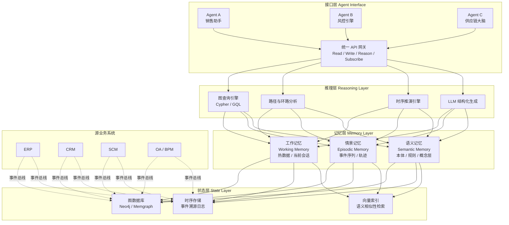
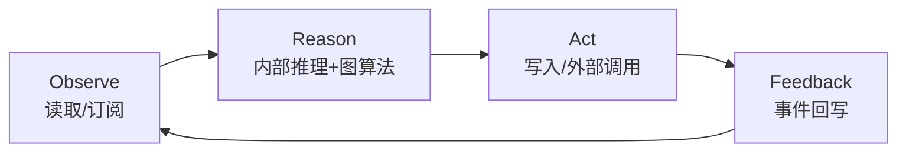

# 企业级世界模型：定义、架构与落地路径

> **版本**：v1.0  
> **关键词**：World Model, Agent, 共享工作记忆, 图数据库, 企业 AI 基础设施  
> **适用读者**：技术架构师、AI 产品经理、企业数字化负责人

---

## 摘要

随着大语言模型（LLM）与智能体（Agent）技术在企业场景的深入渗透，一个核心矛盾日益凸显：**Agent 拥有越来越强的推理与行动能力，却缺乏对企业实时状态的系统性认知**。传统知识库与检索增强生成（RAG）虽然在文档问答场景中表现优异，但本质上仍是“静态信息的搬运工”——它们无法表征企业当前正在发生什么，也无法支持多 Agent 之间的协同记忆与状态共享。

企业级世界模型（Enterprise World Model, EWM）正是为解决这一矛盾而提出的架构范式。它不是物理世界的模拟器，而是**企业当前状态的动态结构化表示**——一个可供 Agent 读取、写入并推理的“共享工作记忆”。本文将系统阐述企业级世界模型的定义与核心特征，剖析其与传统知识库及 RAG 的本质区别，提出基于四层架构的参考实现，并给出基于 Python + 图数据库的具体技术路径与落地建议。

---

## 第一章：企业级世界模型的定义

### 1.1 从“物理模拟器”到“共享工作记忆”

在学术语境中，"World Model" 一词最早源于强化学习领域，指智能体对环境的内部模拟，用于预测行动后果（如 Ha & Schmidhuber, 2018）。然而，在企业语境下，这一定义需要被重新诠释：

> **企业级世界模型**是企业当前运营状态的动态结构化表示。它是一个可被授权的 Agent 读取、写入并执行推理的**共享工作记忆（Shared Working Memory）**，以图结构为核心载体，融合实体、关系、事件与语义，实时反映“企业此刻是谁、在做什么、与外界如何关联”。

这一定义包含三个不可忽视的限定词：

- **企业当前状态**：不是历史档案的堆积，而是对“此刻”业务现实的快照与推演；
- **动态结构化表示**：数据形态是强 schema 与语义网络的结合，而非无结构的文本堆；
- **共享工作记忆**：它是 Agent 之间的“认知公约数”，支持并发访问、版本控制与权限隔离。

### 1.2 三大核心特征

企业级世界模型的价值，建立在其区别于任何传统数据系统的三项核心特征之上：

#### 特征一：动态性（Dynamic Statefulness）

企业的状态每分每秒都在变化：订单状态从“待支付”变为“已发货”，库存水位因采购入库而上升，客户意向因一次电话沟通而转向。世界模型必须能够**捕获、表示并传播这些变化**，而非仅仅存储变化的日志。

动态性要求世界模型具备：
- **事件驱动更新机制**：业务系统产生的事件（Event）是状态变更的单一可信来源；
- **时序感知能力**：任何状态都有有效时间窗口（`valid_from` / `valid_to`），支持历史回溯与未来推演；
- **增量传播能力**：状态变更以发布-订阅模式推送到关注该状态的 Agent。

#### 特征二：结构化（Structured Multi-dimensionality）

世界模型不是文档库，而是一个**多维语义网络**。其结构化体现在：

- **实体层（Entities）**：客户、产品、订单、员工、设备等原子业务对象；
- **关系层（Relations）**：实体之间的业务关联，如“客户-下单-产品”、“员工-负责-项目”；
- **事件层（Events）**：触发状态变更的业务动作，如“付款完成”、“库存预警”；
- **语义层（Semantics）**：基于本体（Ontology）或向量的概念关联，支持同义词、层级与推理规则。

这种多维结构天然适合用**属性图（Property Graph）**表示，因此图数据库成为企业级世界模型的首选存储引擎。

#### 特征三：可交互性（Agent Interoperability）

世界模型不是只读的“数据墓碑”，而是 Agent 可以**主动参与改写**的认知空间。可交互性包含四个操作原语：

| 原语 | 含义 | 示例 |
|------|------|------|
| **Read（读取）** | Agent 查询当前状态与历史轨迹 | 销售 Agent 查询客户的最新意向标签 |
| **Write（写入）** | Agent 提交新的观察或推断 | 客服 Agent 将通话摘要写入客户节点 |
| **Reason（推理）** | Agent 在模型之上执行图查询或逻辑推演 | 风控 Agent 遍历交易网络识别环路欺诈 |
| **Subscribe（订阅）** | Agent 监听特定状态变更事件 | 供应链 Agent 订阅“库存低于安全线”事件 |

这四个原语构成了 Agent 与世界模型之间的标准交互协议，也是多 Agent 协同的基石。

---

## 第二章：本质区别——世界模型 vs 知识库 vs RAG

企业数据系统的演进，大致经历了三个阶段：**传统知识库**（以文档为中心）、**RAG 系统**（以检索增强为中心）、以及正在兴起的**世界模型**（以状态共享为中心）。三者在数据形态、更新机制、交互模式与推理深度上存在本质差异。

### 2.1 对比总览

| 维度 | 传统知识库（KB） | RAG（检索增强生成） | 企业级世界模型（EWM） |
|------|----------------|-------------------|-------------------|
| **数据形态** | 静态文档（PDF、Word、网页） | 向量化文本片段 | 属性图（实体-关系-事件-时序） |
| **更新机制** | 人工上传、版本替换 | 重新切分与嵌入（离线或准实时） | 事件驱动、增量更新、实时传播 |
| **交互模式** | 人找文档 | 人问问题 → 系统检索片段 → LLM 生成答案 | Agent 读/写/推理/订阅 |
| **状态感知** | 无 | 无（仅返回文本片段，不维护状态机） | 强（维护业务对象的实时状态） |
| **推理能力** | 无 | 弱（依赖 LLM 对片段的二次理解） | 强（图查询、路径分析、时序推演、规则引擎） |
| **多 Agent 协同** | 不支持 | 不支持（各会话孤立） | 原生支持（共享工作记忆 + 并发控制） |
| **典型场景** | 规章制度查询、产品手册 | 客服问答、内部知识检索 | 供应链推演、跨部门项目协同、风险预警 |

### 2.2 深入辨析

#### 与知识库的区别：从“查阅档案”到“实时沙盘”

传统知识库的本质是**档案管理**。一份 PDF 文档被上传后，其内容在下次更新前是恒定的。知识库回答的问题是：“公司去年发布了什么差旅政策？”——这是一个关于**历史静态信息**的问题。

世界模型回答的问题则是：“当前有哪些员工正在出差，他们的行程是否与客户拜访计划冲突？”——这是一个关于**实时动态状态**的问题。世界模型中的“员工”节点与“行程”节点通过关系实时关联，Agent 可以遍历这些关系并执行冲突检测。

#### 与 RAG 的区别：从“片段检索”到“全局认知”

RAG 的核心范式是：**将文档切分为片段，嵌入为向量，用户提问时检索最相关的 Top-K 片段，再由 LLM 综合生成答案**。这一范式在企业场景中面临三个结构性瓶颈：

1. **状态盲区**：RAG 返回的是文本片段，不是结构化状态。当用户问“订单 #20250516001 现在在哪里”时，RAG 可能在物流文档中检索到一段关于配送流程的描述，却无法给出该订单的实时节点。
2. **因果断裂**：业务决策往往依赖因果链（如“库存下降 → 触发采购 → 影响现金流”）。RAG 的片段检索无法天然表达这种跨文档、跨系统的因果网络。
3. **协同孤立**：每个 RAG 会话都是独立的，Agent A 在会话中获取的信息不会沉淀为 Agent B 可访问的共享记忆。

世界模型通过**图结构 + 事件驱动 + 共享接口**一次性解决这三个瓶颈：状态以节点属性实时维护，因果以关系边显式建模，所有 Agent 通过统一接口操作同一张图。

> **一句话总结**：知识库是企业的“图书馆”，RAG 是企业的“咨询台”，而世界模型是企业的“实时沙盘与协同作战室”。

---

## 第三章：参考架构设计

### 3.1 整体架构

企业级世界模型的参考架构采用**四层分离**设计，自下而上依次为：状态层、记忆层、推理层与接口层。每层职责单一、边界清晰，既支持独立演进，也支持按需组合。



### 3.2 状态层（State Layer）

状态层是世界模型的“物理现实”，负责持久化所有结构化数据。其核心组件包括：

- **图数据库（主存储）**：采用属性图模型存储实体、关系与事件。推荐 Neo4j 或 Memgraph，前者生态成熟，后者性能优异且兼容 Cypher。
- **时序存储（事件溯源）**：记录每一次状态变更的原始事件，支持审计、回溯与状态重建。可使用图数据库本身的时间树模式，或配合 Kafka + 对象存储。
- **向量索引（语义增强）**：对实体的文本描述、文档摘要等建立向量索引，支持语义相似性检索，弥补精确图查询在模糊匹配上的不足。

### 3.3 记忆层（Memory Layer）

记忆层借鉴认知科学对记忆的分类，将数据按使用频度与抽象层级划分为三类：

- **工作记忆（Working Memory）**：当前活跃的热数据。例如，正在进行的会话上下文、未处理的告警、实时看板指标。工作记忆通常驻留在内存或缓存（如 Redis）中，延迟要求在毫秒级。
- **情景记忆（Episodic Memory）**：按时间线组织的事件序列。例如，“客户 X 在 5 月 1 日提交订单，5 月 3 日发起退款，5 月 5 日重新下单”。情景记忆支持轨迹分析与模式识别。
- **语义记忆（Semantic Memory）**：稳定的概念层与规则层。例如，“钻石客户享有优先发货权”、“退款率高于 10% 触发风控复核”。语义记忆通常以本体（Ontology）或规则引擎的形式维护。

### 3.4 推理层（Reasoning Layer）

推理层是 World Model 的“大脑”，负责在结构化数据之上执行各类认知操作：

- **图查询与遍历**：利用 Cypher 或 GQL 执行多跳关系查询，如“找出所有间接持有供应商 A 股份的客户”。
- **路径与网络分析**：基于图算法（最短路径、PageRank、社区发现、环路检测）识别隐性关联与风险传导路径。
- **时序推演**：结合历史事件序列，预测未来状态（如库存耗尽时间、项目延期概率）。
- **LLM 结构化生成**：将图查询结果（子图）输入 LLM，生成自然语言摘要、决策建议或下一步行动方案。此处的 LLM 不是信息来源，而是**结构化数据的阐释者**。

### 3.5 接口层（Agent Interface）

接口层定义了 Agent 与世界模型交互的标准协议。任何 Agent，无论其底层模型是 GPT-4、Claude 还是自研小模型，只要遵循该协议即可接入共享记忆。

接口层需解决三个工程问题：

1. **统一语义协议**：所有操作通过标准 API（REST / gRPC）暴露，请求与响应采用 JSON-LD 或类似结构化格式，确保跨 Agent 互操作。
2. **并发与一致性**：多 Agent 可能同时读写同一节点。需引入乐观锁、事务隔离或基于 Actor 模型的分片机制，避免竞态条件。
3. **权限与审计**：不同 Agent 拥有不同的数据可见性。例如，财务 Agent 可读取现金流节点，但不可修改人事节点。所有写操作需留下审计日志。

### 3.6 Agent 交互模型：ORAF 循环

Agent 与世界模型的交互遵循 **ORAF 循环**（Observe-Reason-Act-Feedback）：

1. **Observe（观察）**：Agent 通过 Read / Subscribe 原语获取当前相关子图。例如，销售 Agent 订阅“高意向客户”节点的变更事件。
2. **Reason（推理）**：Agent 结合自身目标与读取到的子图，执行内部推理（可调用世界模型的 Reason 接口进行图算法辅助）。
3. **Act（行动）**：Agent 将推理结果转化为 Write 操作写回世界模型，或触发外部系统的动作（如发送邮件、创建工单）。
4. **Feedback（反馈）**：行动结果（成功/失败/新观察）作为新的事件写回世界模型，形成闭环。



### 3.7 事件驱动更新：从业务系统到世界模型

企业级世界模型不可能凭空维护状态，它必须与现有的 ERP、CRM、SCM、OA 等系统打通。推荐采用**事件驱动架构（EDA）**：

1. **源系统**在关键业务动作发生时，向事件总线（如 Kafka、RabbitMQ、云厂商 EventBridge）发布领域事件；
2. **世界模型的接入网关**消费这些事件，将其转换为图数据库的写操作（创建节点、更新属性、建立关系）；
3. **变更传播服务**检测到图数据变更后，向订阅了相关节点/关系的 Agent 推送通知。

这一 pipeline 确保了世界模型与企业真实业务状态之间的高一致性，同时不对源系统造成侵入式改造。

---

## 第四章：Python + 图数据库技术实现路径

### 4.1 技术选型理由

在企业级世界模型的技术栈选型中，**Python + 图数据库**是兼具开发效率、生态成熟度与表达能力的黄金组合：

- **图数据库**：属性图模型天然匹配实体-关系-事件的企业语义；Cypher 查询语言的声明式语法大幅降低了多跳关系查询的复杂度；成熟的图算法库（Neo4j GDS、Memgraph MAGE）开箱即用。
- **Python**：拥有 LangChain、LangGraph 等 Agent 框架，neo4j-python-driver 官方维护，FastAPI 可快速搭建接口层。Python 在数据科学社区的主导地位意味着图分析与 ML pipeline 的集成成本极低。

**推荐组合**：
- **图数据库**：Neo4j（社区版/企业版）或 Memgraph（开源、兼容 Cypher、内存优先）
- **Agent 框架**：LangGraph（适合构建状态机式的多 Agent 工作流）
- **接口层**：FastAPI + Pydantic（类型安全、自动生成 OpenAPI 文档）
- **事件总线**：Apache Kafka 或 Redis Pub/Sub（视企业规模而定）

### 4.2 核心数据模型

以下数据模型以 Cypher 属性图语法描述，兼容 Neo4j 与 Memgraph：

#### 节点类型（Labels）

| Label | 含义 | 核心属性 |
|-------|------|---------|
| `Entity` | 业务实体（客户、产品、员工等） | `entity_id`, `entity_type`, `name`, `status`, `created_at` |
| `Event` | 业务事件 | `event_id`, `event_type`, `payload`, `timestamp`, `source_system` |
| `Agent` | 智能体实例 | `agent_id`, `agent_type`, `version`, `permissions` |
| `Goal` | 业务目标或任务 | `goal_id`, `description`, `priority`, `deadline`, `status` |
| `Concept` | 语义概念（本体节点） | `concept_id`, `name`, `definition`, `embedding` |

#### 关系类型（Relationship Types）

| 关系 | 起点 | 终点 | 含义 |
|------|------|------|------|
| `HAS_STATE` | `Entity` | `Entity` | 实体的当前状态指向（如订单→已支付状态节点） |
| `CAUSED` | `Event` | `Entity` | 事件导致的实体变更 |
| `PARTICIPATED_IN` | `Entity` | `Event` | 实体参与了某事件 |
| `DEPENDS_ON` | `Goal` | `Goal` | 目标之间的依赖关系 |
| `ASSIGNED_TO` | `Goal` | `Agent` | 目标分配给某 Agent |
| `BELONGS_TO` | `Entity` | `Concept` | 实体属于某语义概念 |
| `TRIGGERED` | `Agent` | `Event` | Agent 触发了某事件 |

#### 时序建模策略

世界模型中的状态具有时间维度。推荐采用**时间树（Time Tree）**或**有效时间属性**两种方式：

- **有效时间属性**（轻量级）：在节点上直接维护 `valid_from` 和 `valid_to` 属性，当前状态以 `valid_to: null` 标识。适合状态变更频率中等的场景。
- **时间树**（审计级）：将时间维度独立建模为 `:Year→:Month→:Day→:Hour` 的链表结构，事件节点挂载到对应时间点。适合需要精细时序回溯的场景。

本示例采用**有效时间属性**方案，兼顾简洁与查询效率。

### 4.3 核心代码示例

以下代码展示了基于 **Neo4j + Python + FastAPI** 的企业级世界模型最小可行实现（MVP）。代码包含三个核心模块：世界模型连接层、Agent 观察接口、以及事件驱动的状态更新管道。


#### 模块一：世界模型连接层（`world_model/core.py`）

```python
"""
企业级世界模型 —— 核心连接与 CRUD 封装
依赖：pip install neo4j pydantic
"""
from typing import Optional, List, Dict, Any
from datetime import datetime, timezone
from neo4j import GraphDatabase, Driver
from pydantic import BaseModel, Field


class EntityNode(BaseModel):
    """业务实体节点模型"""
    entity_id: str
    entity_type: str  # 如: Customer, Product, Order
    name: str
    status: str = "active"
    properties: Dict[str, Any] = Field(default_factory=dict)
    valid_from: datetime = Field(default_factory=lambda: datetime.now(timezone.utc))
    valid_to: Optional[datetime] = None  # None 表示当前有效状态


class EventNode(BaseModel):
    """业务事件节点模型"""
    event_id: str
    event_type: str  # 如: OrderPaid, InventoryChanged
    payload: Dict[str, Any] = Field(default_factory=dict)
    timestamp: datetime = Field(default_factory=lambda: datetime.now(timezone.utc))
    source_system: str = "unknown"


class WorldModel:
    """
    企业级世界模型的 Python 封装。
    提供实体创建、事件写入、状态查询与订阅发布的基础能力。
    """

    def __init__(self, uri: str, user: str, password: str):
        self.driver: Driver = GraphDatabase.driver(uri, auth=(user, password))

    def close(self):
        self.driver.close()

    # ------------------------------------------------------------------
    # 写操作：实体与事件
    # ------------------------------------------------------------------

    def create_or_update_entity(self, entity: EntityNode) -> str:
        """
        创建或更新实体节点。
        若存在同一 entity_id 的当前有效节点，则将其 valid_to 置为当前时间，
        再写入新版本，实现状态的时序版本控制。
        """
        cypher = """
        MATCH (e:Entity {entity_id: $entity_id})
        WHERE e.valid_to IS NULL
        SET e.valid_to = datetime()
        WITH count(e) AS _
        CREATE (new:Entity {
            entity_id: $entity_id,
            entity_type: $entity_type,
            name: $name,
            status: $status,
            properties: $properties,
            valid_from: datetime(),
            valid_to: null
        })
        RETURN new.entity_id AS id
        """
        with self.driver.session() as session:
            result = session.run(
                cypher,
                entity_id=entity.entity_id,
                entity_type=entity.entity_type,
                name=entity.name,
                status=entity.status,
                properties=entity.properties,
            )
            return result.single()["id"]

    def record_event(self, event: EventNode, affected_entity_ids: List[str]) -> str:
        """
        记录业务事件，并建立事件与受影响实体的关系。
        这是事件驱动更新的核心入口。
        """
        cypher = """
        CREATE (ev:Event {
            event_id: $event_id,
            event_type: $event_type,
            payload: $payload,
            timestamp: datetime(),
            source_system: $source_system
        })
        WITH ev
        UNWIND $entity_ids AS eid
        MATCH (e:Entity {entity_id: eid})
        WHERE e.valid_to IS NULL
        CREATE (ev)-[:CAUSED]->(e)
        CREATE (e)-[:PARTICIPATED_IN]->(ev)
        RETURN ev.event_id AS id
        """
        with self.driver.session() as session:
            result = session.run(
                cypher,
                event_id=event.event_id,
                event_type=event.event_type,
                payload=event.payload,
                source_system=event.source_system,
                entity_ids=affected_entity_ids,
            )
            return result.single()["id"]

    # ------------------------------------------------------------------
    # 读操作：Agent 观察接口
    # ------------------------------------------------------------------

    def observe_entity(self, entity_id: str, depth: int = 2) -> Dict[str, Any]:
        """
        Agent 观察接口：获取指定实体的当前状态，以及指定跳数内的关联子图。
        返回结构化的子图数据，供 Agent 做下一步推理。
        """
        cypher = """
        MATCH path = (center:Entity {entity_id: $entity_id, valid_to: null})
                     -[*1..$depth]-(neighbor)
        RETURN center,
               relationships(path) AS rels,
               nodes(path) AS nodes
        LIMIT 50
        """
        with self.driver.session() as session:
            records = list(session.run(cypher, entity_id=entity_id, depth=depth))
            if not records:
                return {}

            # 去重并格式化
            node_map: Dict[str, Any] = {}
            rel_list: List[Dict] = []
            for rec in records:
                for node in rec["nodes"]:
                    nid = node.element_id
                    if nid not in node_map:
                        node_map[nid] = dict(node)
                for rel in rec["rels"]:
                    rel_list.append({
                        "type": rel.type,
                        "start": rel.start_node.element_id,
                        "end": rel.end_node.element_id,
                        "properties": dict(rel),
                    })
            return {
                "center_entity_id": entity_id,
                "nodes": list(node_map.values()),
                "relationships": rel_list,
            }

    def query_by_pattern(
        self,
        entity_type: Optional[str] = None,
        status: Optional[str] = None,
        limit: int = 100,
    ) -> List[Dict[str, Any]]:
        """
        模式查询：按实体类型与状态筛选当前有效实体。
        示例：查询所有 status='high_risk' 的客户。
        """
        filters = ["e.valid_to IS NULL"]
        params: Dict[str, Any] = {"limit": limit}
        if entity_type:
            filters.append("e.entity_type = $entity_type")
            params["entity_type"] = entity_type
        if status:
            filters.append("e.status = $status")
            params["status"] = status

        where_clause = " AND ".join(filters)
        cypher = f"""
        MATCH (e:Entity)
        WHERE {where_clause}
        RETURN e
        LIMIT $limit
        """
        with self.driver.session() as session:
            records = session.run(cypher, **params)
            return [dict(rec["e"]) for rec in records]

    # ------------------------------------------------------------------
    # 推理辅助：路径与因果分析
    # ------------------------------------------------------------------

    def trace_causality(self, entity_id: str, hours: int = 24) -> List[Dict[str, Any]]:
        """
        追溯指定实体在最近 N 小时内的所有因果事件。
        适用于风控、审计与故障排查场景。
        """
        cypher = """
        MATCH (e:Entity {entity_id: $entity_id, valid_to: null})
               <-[:CAUSED]-(ev:Event)
        WHERE ev.timestamp >= datetime() - duration({hours: $hours})
        RETURN ev
        ORDER BY ev.timestamp DESC
        """
        with self.driver.session() as session:
            records = session.run(cypher, entity_id=entity_id, hours=hours)
            return [dict(rec["ev"]) for rec in records]

    def find_dependency_chain(self, goal_id: str) -> List[Dict[str, Any]]:
        """
        查找目标之间的依赖链。
        示例：项目里程碑延期时，快速识别受影响的下游交付物。
        """
        cypher = """
        MATCH path = (g:Goal {goal_id: $goal_id})-[:DEPENDS_ON*1..5]->(dependent)
        RETURN dependent.goal_id AS id,
               dependent.name AS name,
               dependent.status AS status,
               length(path) AS distance
        ORDER BY distance
        """
        with self.driver.session() as session:
            records = session.run(cypher, goal_id=goal_id)
            return [dict(rec) for rec in records]
```

#### 模块二：FastAPI 接口层（`world_model/api.py`）

```python
"""
企业级世界模型 —— FastAPI 接口层
为 Agent 提供统一的 Read / Write / Reason / Subscribe 端点。
"""
from fastapi import FastAPI, HTTPException, BackgroundTasks
from pydantic import BaseModel
from typing import List, Dict, Any, Optional
import asyncio

from world_model.core import WorldModel, EntityNode, EventNode

app = FastAPI(title="Enterprise World Model API", version="1.0.0")

# 生产环境应使用连接池与依赖注入
wm = WorldModel(uri="bolt://localhost:7687", user="neo4j", password="password")


# ------------------------------------------------------------------
# 数据契约
# ------------------------------------------------------------------

class EntityCreateRequest(BaseModel):
    entity_id: str
    entity_type: str
    name: str
    status: str = "active"
    properties: Dict[str, Any] = {}


class EventRecordRequest(BaseModel):
    event_id: str
    event_type: str
    payload: Dict[str, Any] = {}
    source_system: str = "manual"
    affected_entity_ids: List[str]


class ObserveResponse(BaseModel):
    center_entity_id: str
    nodes: List[Dict[str, Any]]
    relationships: List[Dict[str, Any]]


# ------------------------------------------------------------------
# 端点定义
# ------------------------------------------------------------------

@app.post("/entities", summary="Write: 创建或更新实体")
def create_entity(req: EntityCreateRequest):
    entity = EntityNode(**req.dict())
    try:
        eid = wm.create_or_update_entity(entity)
        return {"status": "ok", "entity_id": eid}
    except Exception as exc:
        raise HTTPException(status_code=500, detail=str(exc))


@app.post("/events", summary="Write: 记录业务事件")
def record_event(req: EventRecordRequest):
    event = EventNode(
        event_id=req.event_id,
        event_type=req.event_type,
        payload=req.payload,
        source_system=req.source_system,
    )
    try:
        ev_id = wm.record_event(event, req.affected_entity_ids)
        # TODO: 在此处触发订阅通知（Redis Pub/Sub 或 WebSocket）
        return {"status": "ok", "event_id": ev_id}
    except Exception as exc:
        raise HTTPException(status_code=500, detail=str(exc))


@app.get("/observe/{entity_id}", summary="Read: Agent 观察实体子图", response_model=ObserveResponse)
def observe(entity_id: str, depth: int = 2):
    result = wm.observe_entity(entity_id, depth=depth)
    if not result:
        raise HTTPException(status_code=404, detail="Entity not found")
    return ObserveResponse(**result)


@app.get("/query", summary="Read: 模式查询当前有效实体")
def query_entities(
    entity_type: Optional[str] = None,
    status: Optional[str] = None,
    limit: int = 100,
):
    return wm.query_by_pattern(entity_type=entity_type, status=status, limit=limit)


@app.get("/reason/causality/{entity_id}", summary="Reason: 追溯近期因果事件")
def reason_causality(entity_id: str, hours: int = 24):
    return {"entity_id": entity_id, "events": wm.trace_causality(entity_id, hours=hours)}


@app.get("/reason/dependencies/{goal_id}", summary="Reason: 目标依赖链分析")
def reason_dependencies(goal_id: str):
    return {"goal_id": goal_id, "dependencies": wm.find_dependency_chain(goal_id)}


# ------------------------------------------------------------------
# 订阅原型（基于 Server-Sent Events）
# ------------------------------------------------------------------

@app.get("/subscribe/{entity_id}", summary="Subscribe: 监听实体变更")
async def subscribe_entity(entity_id: str):
    """
    Server-Sent Events 原型实现。
    生产环境应接入 Kafka / Redis Stream，实现真正的分布式事件分发。
    """
    async def event_generator():
        # 模拟每 5 秒推送一次心跳与状态快照
        for _ in range(20):
            snapshot = wm.observe_entity(entity_id, depth=1)
            yield f"data: {snapshot}\n\n"
            await asyncio.sleep(5)

    from fastapi.responses import StreamingResponse
    return StreamingResponse(event_generator(), media_type="text/event-stream")
```

#### 模块三：事件接入网关（`world_model/ingest.py`）

```python
"""
企业级世界模型 —— 事件接入网关
将外部业务系统的事件转换为图数据库写入操作。
可独立部署为 Kafka Consumer 或云函数。
"""
import json
from world_model.core import WorldModel, EventNode, EntityNode

wm = WorldModel(uri="bolt://localhost:7687", user="neo4j", password="password")


def handle_erp_order_paid(payload: dict) -> None:
    """
    处理 ERP 系统发出的 OrderPaid 事件。
    示例 payload:
    {
      "order_id": "ORD-20250516-001",
      "customer_id": "CUST-9527",
      "amount": 15000.00,
      "paid_at": "2025-05-16T14:30:00Z"
    }
    """
    order_id = payload["order_id"]
    customer_id = payload["customer_id"]

    # 1. 更新订单实体状态
    order_entity = EntityNode(
        entity_id=order_id,
        entity_type="Order",
        name=f"Order {order_id}",
        status="paid",
        properties={"amount": payload["amount"], "paid_at": payload["paid_at"]},
    )
    wm.create_or_update_entity(order_entity)

    # 2. 记录事件节点，并关联受影响实体
    event = EventNode(
        event_id=f"EVT-{order_id}-PAID",
        event_type="OrderPaid",
        payload=payload,
        source_system="ERP",
    )
    wm.record_event(event, affected_entity_ids=[order_id, customer_id])

    print(f"[Ingest] Order {order_id} marked as paid, event recorded.")


def route_event(source_system: str, event_type: str, payload: dict) -> None:
    """简单的事件路由分发器。"""
    handler_key = f"{source_system.lower()}_{event_type.lower()}"
    handlers = {
        "erp_orderpaid": handle_erp_order_paid,
        # 在此处扩展更多 handler：scm_inventorychanged, crm_leadupdated, ...
    }
    handler = handlers.get(handler_key)
    if handler:
        handler(payload)
    else:
        print(f"[Ingest] No handler for {handler_key}, skipping.")


# 本地测试入口
if __name__ == "__main__":
    test_payload = {
        "order_id": "ORD-20250516-001",
        "customer_id": "CUST-9527",
        "amount": 15000.00,
        "paid_at": "2025-05-16T14:30:00Z",
    }
    route_event("ERP", "OrderPaid", test_payload)
```

### 4.4 代码说明与演进建议

以上三段代码构成了企业级世界模型的**最小可行产品（MVP）**：

- **`core.py`** 封装了时序状态管理、Agent 观察与因果追溯，是世界模型的“内核”；
- **`api.py`** 暴露了标准的 REST 接口，任何 Agent（无论基于何种框架）均可通过 HTTP 调用接入；
- **`ingest.py`** 演示了从外部系统事件到图结构更新的转换逻辑，可作为 Kafka Consumer 的模板。

**向生产环境演进时，建议关注以下增强点**：

1. **事务与一致性**：Neo4j 的 ACID 事务可保证单节点写入的一致性；跨节点分布式事务需引入 Saga 模式或两阶段提交。
2. **权限隔离**：在接口层增加 RBAC（基于角色的访问控制），利用 Neo4j 的子图访问控制（Graph Data Science 企业版）或应用层过滤实现数据隔离。
3. **性能优化**：高频写入场景下，考虑批量写入（`UNWIND` + 参数列表）、异步 driver 以及读写分离集群。
4. **LLM 集成**：在 `reason_causality` 等端点中，将图查询结果序列化为文本或 JSON，通过 LangChain 的 `GraphCypherQAChain` 让 LLM 生成自然语言洞察。

---

## 第五章：落地场景与演进路线

### 5.1 典型落地场景

#### 场景一：供应链异常感知与推演

一家制造企业的供应链涉及数百家供应商、数千个 SKU 与多级仓储。传统 BI 报表只能告诉管理者“上周库存如何”，而世界模型可以实时回答：

> “供应商 A 因台风停产（事件）→ 其提供的芯片库存将在 3 天后跌破安全线（推演）→ 影响下游产品 X 与 Y 的排产计划（依赖链）→ 建议立即启动备选供应商 B 的认证流程（行动建议）。”

在世界模型中，供应商、物料、库存、产线计划均为 `Entity` 节点，台风停产为 `Event` 节点，通过 `DEPENDS_ON` 与 `CAUSED` 关系构成可推演的因果网络。供应链 Agent 订阅关键库存节点的变更，实时触发推演与告警。

#### 场景二：跨部门项目协同

一个新产品上线涉及产品、研发、市场、法务四个部门。各部门 Agent（或代表部门的人工用户）在世界模型中共享同一套项目状态：

- 研发 Agent 将“后端 API 开发完成”写回世界模型；
- 市场 Agent 的订阅触发，自动将“素材准备”任务状态更新为“可启动”；
- 法务 Agent 查询 `DEPENDS_ON` 链，确认合同审批是否阻塞了上线节点。

世界模型在此充当了**跨部门的状态共识层**，消除了“群里 @ 所有人”导致的信息碎片化。

#### 场景三：客户需求推演

在 B2B 销售场景中，世界模型整合 CRM 中的客户档案、历史订单、支持工单与外部新闻（如客户公司融资动态），形成动态客户画像。销售 Agent 可以执行如下推理：

> “客户 Z 在 Q1 采购了 100 台服务器（历史）→ 其融资新闻显示正在扩张东南亚节点（外部事件）→ 推断 Q3 存在 50 台增量需求（推演）→ 建议下周发起技术方案沟通（行动）。”

### 5.2 三阶段演进路线

企业级世界模型的建设不应追求“大爆炸式”上线，而应遵循**由点及面、由静到动、由单 Agent 到多 Agent 协同**的渐进路线：

#### 阶段一：单一业务线的实体关系建模（1–3 个月）

- **目标**：在一张业务线（如订单履约或客户画像）中，建立核心实体-关系图，替代部分静态报表。
- **关键动作**：
  - 梳理该业务线的 5–10 个核心实体与 10–15 种核心关系；
  - 接入 1–2 个源系统（如 ERP 或 CRM）的事件流；
  - 开发 1 个 Agent（如“履约监控助手”），实现 Read + Subscribe。
- **成功标准**：该业务线的关键状态查询延迟从“小时级（报表）”降至“秒级（图查询）”。

#### 阶段二：多 Agent 共享记忆与权限体系（3–6 个月）

- **目标**：扩展至 2–3 个业务线，引入多 Agent 协同与权限隔离。
- **关键动作**：
  - 建立统一的本体层（Ontology），标准化跨业务线的实体定义；
  - 引入记忆层分层：工作记忆（Redis）、情景记忆（图时序树）、语义记忆（规则引擎）；
  - 开发权限中间件，确保财务 Agent 不可写入人事节点。
- **成功标准**：两个不同部门的 Agent 可基于同一客户节点协同工作，且数据访问符合合规要求。

#### 阶段三：企业级世界模型平台（6–12 个月）

- **目标**：世界模型成为企业 AI 基础设施，接入所有核心业务系统，支持自定义 Agent 注册。
- **关键动作**：
  - 建立事件总线与企业服务总线（ESB）的对接规范；
  - 提供低代码本体编辑器和 Agent SDK；
  - 引入图算法平台（GDS / MAGE），支持复杂网络分析；
  - 建立世界模型的“模型运维”体系：数据质量监控、schema 演进管理、推理结果审计。
- **成功标准**：新业务线接入世界模型的平均时间从“数月”降至“数天”。

---

## 结语

企业级世界模型不是又一套“数据中台”或“知识库”，它是企业 AI 从**工具**走向**同事**所需的基础设施。传统知识库回答“文件里写了什么”，RAG 回答“根据这些片段你怎么看”，而世界模型回答的是**“企业此刻正在发生什么，接下来可能会发生什么，以及我们应该做什么”**。

这一转变的本质，是从**信息检索**迈向**状态认知与协同行动**。世界模型提供的不是文本片段，而是一个活的、结构化的、可被 Agent 共同改写的共享工作记忆。

落地世界模型并不需要推翻现有系统。我们建议从**一小片业务图结构**开始——可能是订单履约网络，可能是客户旅程路径——接入一两个事件源，让一个 Agent 学会观察与写入。随着图的扩展、事件的丰富与 Agent 的增多，世界模型将自然生长为企业数字化运营的“认知中枢”。

**下一步行动建议**：

1. **识别高价值试点**：选择一个状态变更频繁、跨系统依赖明显的业务线（如供应链、项目管理）作为切入点；
2. **搭建最小图模型**：用 Neo4j/Memgraph 建模 5–10 个核心实体，验证图查询对业务问题的表达能力；
3. **接入第一个事件流**：从 ERP 或 CRM 的 webhook / 消息队列中消费领域事件，驱动图的动态更新；
4. **赋予 Agent 第一双“眼睛”**：让第一个 Agent 通过 `/observe` 接口读取世界模型，验证其决策质量是否因结构化状态感知而提升。

世界模型的建设是一场长跑，但每一步都值得。

---

## 附录：术语表

| 中文术语 | 英文术语 | 简要释义 |
|---------|---------|---------|
| 世界模型 | World Model | 智能体对环境的内部结构化表示，用于状态感知与推理 |
| 共享工作记忆 | Shared Working Memory | 多 Agent 可并发访问与修改的统一状态空间 |
| 属性图 | Property Graph | 由节点、关系与属性构成的图数据模型 |
| Cypher | Cypher | Neo4j 提出的声明式图查询语言 |
| 事件驱动架构 | Event-Driven Architecture (EDA) | 以事件为核心进行系统间通信与状态同步的架构风格 |
| 本体 | Ontology | 对特定领域概念及其关系的规范化描述 |
| ORAF 循环 | Observe-Reason-Act-Feedback | Agent 与世界模型交互的观察-推理-行动-反馈闭环 |
| RAG | Retrieval-Augmented Generation | 检索增强生成，通过外部文本检索提升 LLM 回答质量的技术 |
| 时序版本控制 | Temporal Versioning | 对数据状态维护有效时间窗口，支持历史回溯 |
| 情景记忆 | Episodic Memory | 按时间序列组织的事件记忆，支持轨迹回溯 |
| 语义记忆 | Semantic Memory | 稳定的概念、规则与事实记忆，不随单次事件改变 |

---

*本白皮书基于当前企业 AI 与图数据库技术生态撰写，架构与代码示例可根据实际业务需求与技术栈进行调整。*
